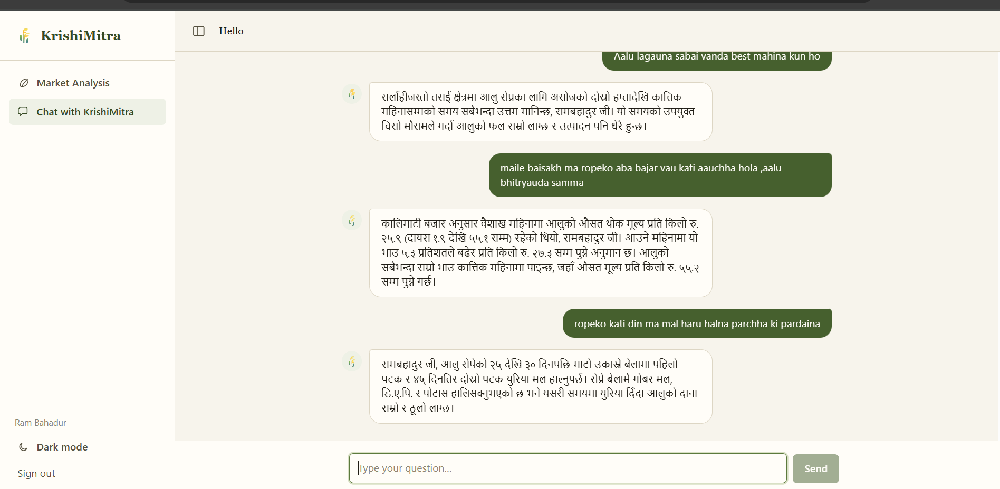
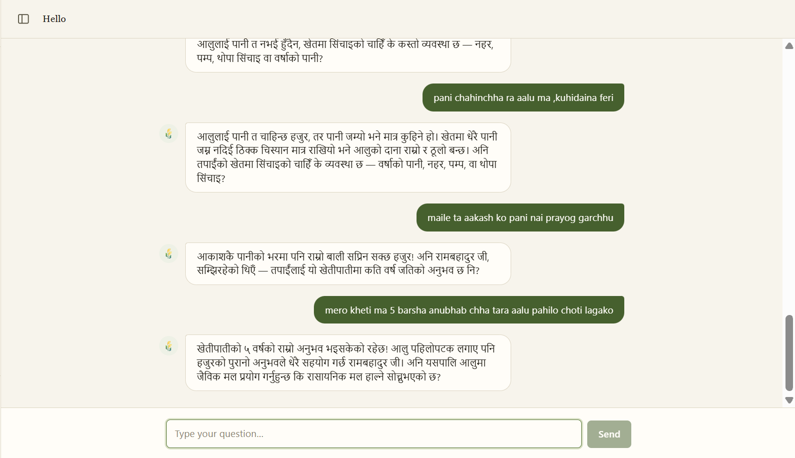
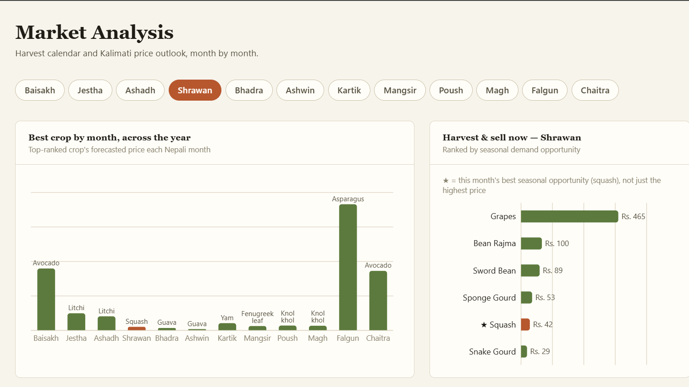
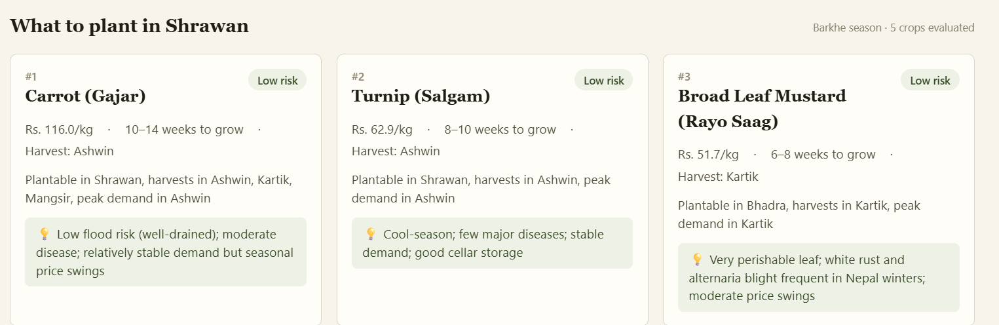
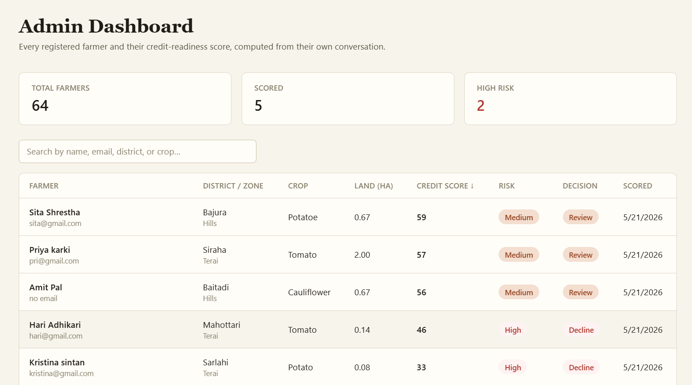

# 🌾 KrishiMitra (कृषिमित्र)

An AI farming companion for Nepali farmers — chat in Nepali (Devanagari or Romanized), get district-accurate crop advice, live weather alerts, market price forecasts, disease help, and a credit-readiness score built from your own conversation.

You can see the full technical analysis [here](docs/case_analysis.md).


<!-- Drag & drop your demo video (.mp4, <10 MB) into this file on GitHub's web editor
     and it will embed automatically. For YouTube, use the thumbnail-link form below. -->


## Screenshots

### Chat



The chat runs a **multi-slot extraction** on every message — one LLM call pulls out every profile field the farmer stated (crop, district, land size, irrigation, experience, loans), not just whatever field was last asked, so a message like "Kavre ma 2 ropani alu cha" fills district + land + crop in one turn. Rules then validate and normalise each value before it's saved.

Direct questions (price, weather, harvest timing, "what should I plant/harvest this month") bypass profile collection entirely — a keyword + LLM intent router sends them straight to the relevant engine, which computes the actual facts (prices, dates, forecasts) from real data — the crop calendar, the price forecast model, the live weather API. The LLM (Gemini) is only ever handed those computed facts and told to phrase them naturally in Nepali — it never invents a number or date itself. Disease/pest questions and general farming knowledge instead pull from a **RAG pipeline**: crop guide PDFs and the *Krishi Diary 2082* (its legacy-font pages were OCR'd to Devanagari via Gemini vision) are chunked and embedded into a vector store, then retrieved by similarity search to ground the answer.

### Market Analysis




Picking a Nepali month shows two things computed from the same data: a **12-month overview** of the single best-forecast crop per month (a price forecasting model trained per crop on years of Kalimati wholesale price history), and a **"harvest & sell now" ranking** for the selected month specifically — the crop calendar's harvest windows are joined against that month's forecast and demand-opportunity score, so it surfaces crops actually in season, not just whatever is priciest that month.

Below that, the recommendation cards run a full feasibility + risk + price evaluation per candidate crop for the selected month (district zone, altitude, growth duration, weather) and rank them — this is the same evaluation the chat's "what to plant" answers are grounded in, just browsable by month instead of asked one at a time.

### Admin Dashboard



Every registered farmer, joined with their account email, alongside the credit-readiness score already computed from their conversation (land size, irrigation, experience, crop, debt-to-income ratio) — nothing is recalculated for this view, it just displays what scoring already produced. The table is sortable by score and searchable by name/district/crop; clicking a row expands the full score breakdown, loan/income figures, and the risk notes the scorer generated, so a loan officer can review or decline without re-reading the whole conversation.

## Features

- **Conversational profile collection** — the bot chats naturally in Nepali and extracts crop, district, land size, irrigation, experience, loans etc. from free-form messages (multi-slot LLM extraction + rule validation).
- **Advisory intent-router** — ask directly, get engine-computed answers (never hallucinated):
  - *"अहिले के लगाउने?"* → crop recommendations by district zone + altitude + month, annotated with live weather
  - *"आलुको भाउ कति?"* → Kalimati price forecast with trend % and best-selling month
  - *"पानी पर्छ?"* → 7-day Open-Meteo forecast with frost / heat / heavy-rain alerts
  - *"कहिले टिप्ने?"* → harvest window projected from sowing month
- **Disease & pest answers** — RAG-grounded first-aid guidance with treatment options.
- **Knowledge base (RAG)** — crop guide PDFs + the *Krishi Diary 2082* (legacy-font pages OCR'd to Devanagari via Gemini vision, table-aware chunking, BGE-M3 embeddings in Qdrant).
- **Credit scoring** — estimates seasonal income (district yields × market prices) and produces a 0–850 score with breakdown; admin dashboard included.


## Architecture

```
React (TanStack Router/Query) ──► FastAPI (/api/v1) ──► Dialogue policy (rules, unit-tested)
                      │                     │
                      │                     ├── Engines: crop_advisor · price_snapshot ·
                      │                     │   market_calendar · weather · calendar · credit scorer
                      ├── MongoDB           └── LLM (Gemini) renders replies from
                      │   users · profiles ·     engine-computed DATA facts
                      │   conversation_history · chat_sessions
                      └── Qdrant (embedded local or cloud) ── BGE-M3 embeddings
```

Design rule: **Python decides, the LLM only phrases.** Facts (crops, prices, dates, weather) come from engines/data and are injected as an authoritative DATA block.

## Setup

**Prereqs:** Python 3.11+, MongoDB (Atlas or local), a Google AI Studio API key.

```bash
pip install -r requirements.txt
```

Create `.env`:

```env
MONGODB_URI=mongodb+srv://...
GOOGLE_API_KEY=...
QDRANT_URL=./qdrant_local        # local embedded store — or https://<cluster>.qdrant.io for cloud
QDRANT_API_KEY=                  # only for cloud
JWT_SECRET=change-this-in-production
```

## Run

```bash
# Backend (port 8000)
uvicorn main:app --reload

# Frontend (port 5173)
cd frontend
npm install
npm run dev
```

Set `VITE_API_BASE_URL` in `frontend/.env.local` if the backend isn't on `http://127.0.0.1:8000/api/v1`.

API docs: http://localhost:8000/docs

## Knowledge-base ingestion

```bash
# Crop guide PDFs in ingest/ → Qdrant
python -m rag.ingest

# Krishi Diary (legacy fonts → Gemini vision OCR → Markdown cache → Qdrant)
python -m rag.ingest_vision transcribe   # paid, cached per page, resumable
python -m rag.ingest_vision ingest       # free, re-runnable
```

Transcribed pages are committed in `output/diary_md/`, so re-ingestion costs nothing.
Note: embedded Qdrant is single-process — stop the backend before running ingestion.

## Data

All CSV/JSON data lives under `data/` (previously split across `data/` and a separate `dataset/`, now merged):

| Source | Coverage |
|---|---|
| `data/crop_calendar.csv` | 90 crops — planting/harvest months, altitude range, diseases |
| `data/crop_risks.csv` | 90 crops — flood/drought/frost/price-volatility risk scores |
| `data/yield.csv` | 80 districts — per-district crop yields |
| `data/forecast_cache.csv` | Prophet price forecasts per crop per BS month |
| `rules/zone_classifier.py` | 83 districts → Terai / Hills / Mountains |
| `data/legacy/` | superseded/unused source files, kept for reference only |

## Key endpoints

| Endpoint | Purpose |
|---|---|
| `POST /api/v1/auth/register` · `/login` | JWT auth |
| `POST /api/v1/chat` | main conversational endpoint (accepts/returns `session_id`) |
| `GET /api/v1/chat/sessions` · `POST` | list / start chat sessions (sidebar threads) |
| `GET /api/v1/chat/sessions/{id}/messages` · `DELETE` | one session's history / delete it |
| `POST /api/v1/advisory` | full LangGraph advisory pipeline |
| `GET /api/v1/market/forecast` | Prophet price forecasts |
| `GET /api/v1/market/calendar` · `/{bs_month}` | harvest calendar × price forecast, joined |
| `GET /api/v1/crops/filtered/{bs_month}` | plantable crops for a BS month |
| `POST /api/v1/forecast/retrain` | refresh the Prophet cache |

## Tests

```bash
python -m pytest tests/ -q     # 114 tests: dialogue flow, intents, engines, extraction
```

## Project layout

```
api/        routes, auth                    rules/      dialogue policy, extractors, validators
engine/     crop/price/market/risk engines   rag/        embeddings, retriever, ingestion
core/       profile, credit score,           graph/      LangGraph advisory workflow
            scheduled notifications         data/       CSVs (calendar, risks, yields, prices)
db/         MongoDB models + CRUD           models/     trained model artifacts (.pkl, .keras)
tests/      pytest suite                    scripts/    one-off/maintenance scripts (run with -m)
frontend/   React + TanStack Router/Query UI
```
